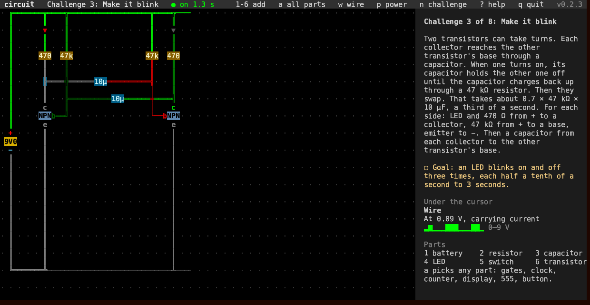
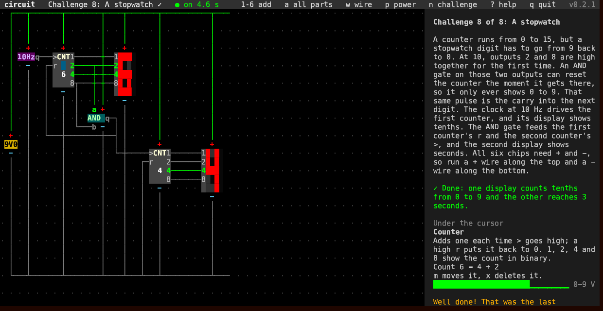

# circuit



**Build circuits in the terminal and watch them work. Written in Rust.**

   

Put batteries, resistors, capacitors, LEDs, switches and transistors on a
grid, wire them up and power on. Then move on to logic chips: gates, a
clock, a counter, a digit display and the 555 timer.

Every voltage and current is worked out as you watch: wires glow green
with voltage, LEDs light up with their current, and an LED with no
resistor burns out. Challenges teach one idea at a time, and each one
ticks itself off when your circuit works.

The panel on the right names what the cursor is on, down to the pin, and
what it is doing.

Part of the [Fe₂O₃ suite](https://isene.github.io/fe2o3/). Built on
[crust](https://github.com/isene/crust).



## The challenges

1. **Light an LED** without burning it out, and find out why it needs a
   resistor.
2. **A transistor as a switch**: a tiny current through a switch turns a
   big LED current on and off.
3. **Make it blink**: two transistors and two capacitors take turns, a
   third of a second each.
4. **Logic gates**: two switches and an AND gate, and the LED lights only
   when both are on.
5. **Count in binary**: a clock drives a counter, and four LEDs count
   from 0 to 15.
6. **Numbers on a display**: the counter's four outputs become a digit,
   0 to F.
7. **The 555 timer**: the classic chip blinks an LED with two resistors
   and a capacitor.
8. **A stopwatch**: an AND gate makes a counter stop at 9 and carry into
   the next digit.



`n` steps through them, and a free board is always there for building
anything else. Every board is kept in `~/.circuit/` when you quit.

## Keys

| Key | Action |
|---|---|
| `←` `↑` `↓` `→` / `h` `j` `k` `l` | move the cursor |
| `1` … `6` | add a battery, resistor, capacitor, LED, switch or transistor |
| `a` | pick any part: gates, clock, counter, display, 555, button |
| `w` | draw a wire: move to lay it, `w` again stops |
| `.` | join two wires that cross; crossing wires do not touch |
| `x` | delete the wire or part under the cursor |
| `o` | turn a part (chips do not turn) |
| `m` | move a part: the arrows carry it, `m` drops it |
| `+` `-` | change a value, an LED's colour or a clock's speed |
| `Space` | flip a switch, press a button |
| `r` | replace a burnt-out LED |
| `p` | power on or off |
| `n` `N` | next or previous challenge |
| `R` `R` | put the board back to its start |
| `?` | every key |
| `q` | quit |

Values are printed the way they are marked on real parts, with the unit
letter standing in for the decimal point: `4k7` is 4.7 kΩ, `10µ` is
10 µF, `9V0` is 9 V.

## How it works

Every junction's voltage is unknown. The currents flowing into a junction
must add up to zero, so each junction gives one equation, and they are
solved together. A capacitor remembers its voltage from one millisecond
to the next. LEDs and transistors bend the equations, so each step
repeats the solve until the numbers settle.

Every logic chip has a + pin on top and a − pin below, and does nothing
until both are wired to a battery. A high output joins its wire to the
chip's + through 100 Ω, a low one to its −. So the current comes from the
battery, and an LED on an output still needs its resistor. An input reads
high above 60% of the chip's voltage and low below 40%.

Real parts are never exactly their marked value, so each one is off by up
to 1%. That is also what lets a blinker pick a side and start.

The solver runs only while the power is on and something is still
changing. A circuit that has settled costs nothing. A blinking one costs
about 16 ms of processor time a second, and the running stopwatch about 5.

## Install

```bash
git clone https://github.com/isene/circuit
cd circuit
cargo build --release
```

`crust` is expected as a sibling checkout (`../crust`). Release binaries
for Linux and macOS are on the
[releases page](https://github.com/isene/circuit/releases).

## License

Public domain (Unlicense).
